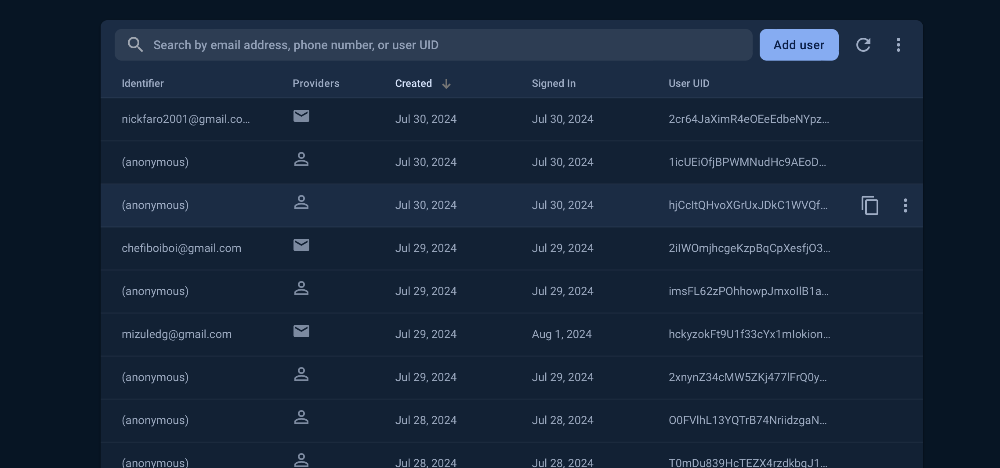

# TruckIt
If unable to view this file correctly please refer to readme.pdf
## Locations
- Code for customer app is located in TruckIt-Customer-App/lib
- Code for driver app is located in TruckItDriver/truckit/lib
- pubspec.yaml configuration file located in TruckItDriver/truckit/pubspec.yaml and TruckIt-Customer-App/pubspec.yaml
- Podfile configuration file located in located in TruckItDriver/truckit/ios/Podfile and TruckIt-Customer-App/ios/Podfile
- images of database located in images folder
2 configuration files required for each as there are 1 in each app.

Located in this README are the following:
- Project Goals
- Core components
- Database components and Documentation
- Notes 
- Configuration
- Some information is elaborated on in the Design Document.

## Project Goals
Our project goals consisted mainly of the following:
- Realtime location tracking
    - Display real-time locations of food and ice cream trucks on a map.
    - Enable live tracking of truck and customer movement.
- User Functionalities (Customer App)
    - Search and Discovery:
        - Search for trucks by type of food, cuisine, or specific truck names.
        - Browse trucks by categories such as most popular, nearest, and new trucks.
    - Truck Information Display:
        - Display detailed information about each truck, including menu, prices, photos, and whether they are active or not.
        - Filter trucks
        - View nearby trucks on live map
        -  Show truck schedules, including operating hours and planned stops. (not met)
    - Request Feature:
        - Allow users to request trucks to come to their location for events or gatherings. (not met)
        - Provide a form for users to specify the event details and preferred time. (not met)
    - Navigation Assistance:
        - Provide directions to the truck location using integrated mapping services.
- User Functionalities (Driver App)
    - Route Planning and Navigation:
        - Assist drivers with route planning to optimize their stops based on user demand and company preferences.
        - Provide turn-by-turn navigation to the next stop or hotspot.
    - Ability to go live
    - Profile and Menu management

Most of these goals were met and exceeded. The one goal we unfortuantely did not get to was requesting and scheduling trucks, simply by choice. We did not find it necessary to implement a tough feature as it does not fit what we envisioned TruckIt as. TruckIt is not something that should be a complicated, intricate app with an overwhelming amount of nifty features. Mobile applications are rarely used, the app's plainness makes it a device that a user only needs to spend 5-10 minutes on at a time. It is simply to show you where trucks are, and the journey you make of it is up to you. The simplicity of the app does not overshow the complex features we have successfully implemented, such as realtime location updates, truck profile/menu mangagement, filtering, and search functionality. However the feeling of simplicity and tutorial-less features are what we envisioned for TruckIt. The speed we had envisioned for the app was also exceeded, thanks to Firebase's realtime and live data updates. The project was very successful overall and came out much better than we originally hoped for.

## Core components
### Software
- iOS and Android Simulators for testing
- Flutter framework (framework provided by Google that allows the same code to be ran on any mobile device or computer)
    - Dart Language
- Google Maps API
- Firebase (Google's backend cloud service for application development)
    - User Auth
        Firebase's "Auth" automatically takes input as sign in credentials and verifies upon previously created accounts. It stores this information here, and also allows you to configure the sign-in options. Anonymous was used for customers as they do not have to make an account, which enabled some reading and no writing permissions.
        

          

    - Firestore Database
        The main database, containting datatext in a hierarchial structure. It is broken up into collections, which cotain other collections, etc. Some collections contain documents, in which their fields hold the data. The two main collections are users and companies, where user contains company id to correlate to corresonding company. Within company collection contains truck collection, profile and menu collection, and menu attributes such as section, item, and item information.
        

          
    - Realtime Database
        Used for realtime location updates, storing coordinates.
        

          
    - Storage
        Holds images which correspond to URL in firestore, allowing the application to store, retrieve, and display the images.
        

          

Firebase was managed using Google's console at console.firebase.google.com which are shown in the above images.

### Hardware
- iPhone 12 & iPhone 15 Pro (for development testing and presentation)

## Configuration Files
### pubspec.yaml 
(located in TruckItDriver/truckit/pubspec.yaml)
(also located in TruckIt-Customer-App/pubspec.yaml)

This configuration files contains dependencies for external packages to automatically be retrieved and used upon building the code. This included
    - all firebase cloud services
    - image_picker: used for using device's photo picker for photo uploads.
    - google_maps_flutter: display google map
    - location: used for retrieving user location

### Podfile
This configuration file was responsible for setting requirements for iOS device such as iOS release, build settings, and firebase integration. iOS required more configuring than android.

## Notes
The weirdest part of this project was learning flutter and dart. Dart at first seemed like a more complex version of CSS, but as we went on to learn and experiment with widgets, we realized the capabilities with the Flutter Framework are endless. Learning as we were implementing was a challenge, as well as warming up to syntax. The unexpected really came when configuing our environments: setting up Google Maps API and Firebase for our app was a challenge in it's own, but maintaining these configuarions between two developers became extremely tricky. Different rules had to be set within XCode for each individual programmer in order to grant access to run the app on a phsyical device or simulator. This required us to manage our git repository very carefully, as if even just 1 out of the thousands of files in Flutter's framework were configured to the other developer's account, the entire project would fail to run. We eventually got use to this and proceeded to implement our app without carrying that weight.

   